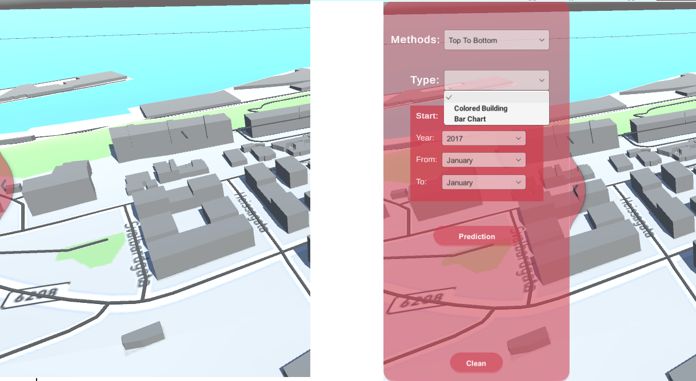
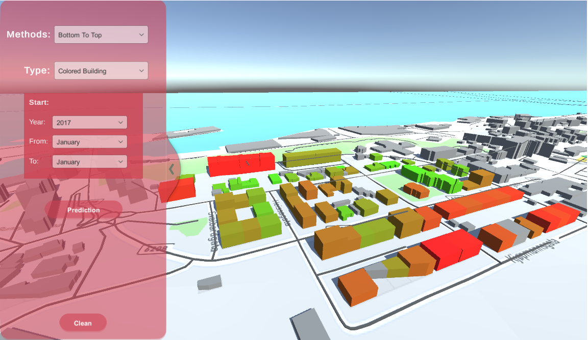
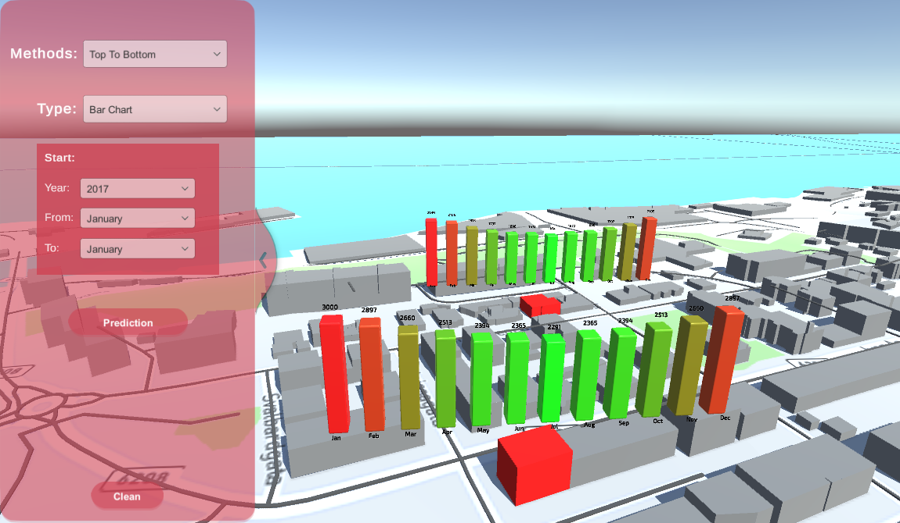

# Data-Driven Digital Twin for Development of Smart Sustainable Cities. Case Study: ˚ Alesund, Norway

We have used a GIS-based model to 3D-visualize household energy consumption in Ålesund using the Unity 3D game engine. In a GIS-based model possible to have a flexible energy model which is applicable to different energy scenarios on the urban scale. Recently, 3D city modeling with game engines like Unity 3D has been increased for better urban data visualization and support of applications that involve urban planning, traffic control, navigation, and other city services. In this application, two visualization methods are used to illustrate the energy amount and the user interface will be a floating red scroll bar as shown below.

The floating scroll has enclosed methods, type, start, and end date of energy data visualization. In the designed interface for the methods section, if we choose the Colored Building at a specific time, for example in 2017 during the January, houses with the highest energy consumption will be shown in red, and houses with the lowest energy consumption will be shown in green, and the others will be colored as a spectrum between red and green. The colored buildings are demonstrated in Figure below. This 3D energy visualization of the building can show the future retrofitting scenarios for each house. Also, this type of visualization gives the users a good vision to understand the distribution of energy consumption of buildings in an area and with a closer look at details, they find out the area with higher energy consumption. This view can help to make a better decision about increasing the grid capacity or energy flexibility in a neighborhood.

Another possible type of energy consumption visualization is Bar Chart which is done in this application and shown in Figure below. In this type, the energy consumption of each building during a year is illustrated, and bars are colored based on their values. It can be seen that the maximum amount of energy consumption is in January and December, while its minimum values happen in June and July. This was to be expected due to the climate of Ålesund during a year. With the bar chart method possible to see the variations in energy consumption in different months of the year. Generally, as shown in cold seasons with longer red bars, the consumption of energy commodities are higher than in warm seasons with green shorter bars. The numbers and seasons label are also visualized for each bar to compare the data of different seasons for the same house and also with other neighbors' houses.

In this work, the energy consumption data of a restricted region in Ålesund city is visualized, better to say a 3D energy atlas, with the help of the Unity 3D Game engine. Unity with the given algorithms has the potential to predict the future energy demand of each household before and after retrofitting. Game engine applications are also capable to visualize other urban data like walkability, traffic data, or solar power data to be more comprehensive and realistic for decision-makers. 
